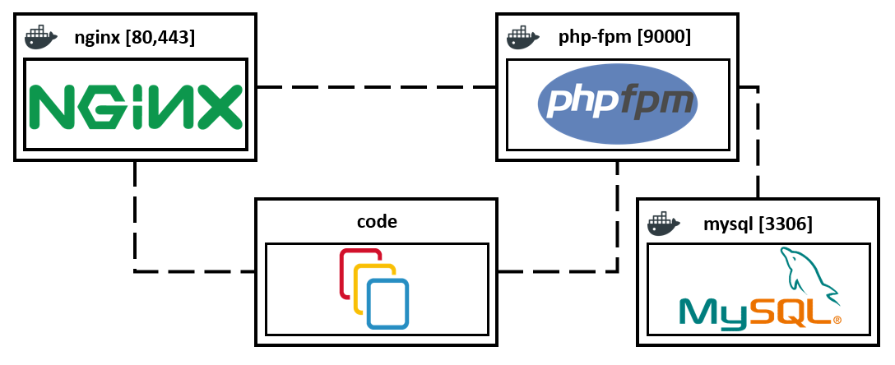

## Nginx + php7.4-fpm + symfony + mysql docker compose
An easy way to set up your Symfony application using Docker and docker-compose.
This will set up a development environment with nginx, php7.4-fpm, and mysql.


## Overview
1. [Structure](#structure)
2. [Setting the ENV file for docker-compose](#setting-the-env-file-for-docker-compose)
3. [Docker-compose configuration](#docker-compose-configuration)
4. [Quickstart for linux](#quickstart-for-linux )
5. [Quickstart for Windows](#quickstart-for-windows)
6. [Use docker commands](#use-docker-commands)
7. [Self-signed certificate on Nginx](#self-signed-certificate-on-nginx)
    * [Add this area in nginx.conf](#add-this-area-in-nginx.conf)
8. [Configure nginx with SSL certificates "CertBot"](#configure-nginx-with-ssl-certificates-certbot)
9. [Contributing](#contributing)


___
### Structure 
~~~
+---docker
|   |   .env
|   |   .env.dist
|   |   .gitignore
|   |   docker-compose.yml
|   |   run.sh
|   |
|   \---services
|       +---mysql
|       |       Dockerfile
|       |
|       +---nginx
|       |   |   .dockerignore
|       |   |   .gitignore
|       |   |   app.conf
|       |   |   Dockerfile
|       |   |   nginx.conf
|       |   |
|       |   \---logs
|       |           access.log
|       |           error.log
|       |
|       \---php
|               Dockerfile
|               php.ini
|               www.conf
|
\---images
\---web
    \---bin
    \---config
    \---public
    \---src
    \---var
    \---vendor
|   |   .env
|   |   .env.dist
|   |   .gitignore
|   |   composer.json
|   |   composer.lock
|   |   symfony.lock
~~~
___
### Setting the ENV file for docker-compose

It includes the following:
~~~
APP_PATH=../web
WORKING_DIR=/code

PROJECT_NAME=project

VIRTUAL_HOST=localhost #for example you can use: project.local
APP_ENV=dev #prod

MYSQL_DATABASE=db_project
MYSQL_USER=user
MYSQL_PASSWORD=password
MYSQL_ROOT_PASSWORD=root
~~~

___
### Docker-compose configuration

It includes the following:
~~~
- NGINX
  - port 80 (default)
  - port 443 for SSL connection (default)
  - use depends_on "php" #Express dependency between services
- PHP
  - FPM configured for NGINX
- MySQL
  - port 3306 (default)
~~~

___
### Quickstart for linux 

Need install:
- docker 18.06.0+
- docker-compose 1.18.0+

If you WANT to use yourself host name, you MUST run:
- ```echo "127.0.0.1 project.local" >> /etc/hosts```

Create new .env file, copy content from .env.dist
- cd /YOUR_PROJECT_DIRECTORY/docker
- ```cp .env.dist .env```

Create new .env file, copy content from .env.dist
- cd /YOUR_PROJECT_DIRECTORY/web 
- ```cp .env.dist .env```

Open Bash in /YOUR_PROJECT_DIRECTORY/docker:
- ```./run.sh```

Next step:
* ```docker exec -it project_php composer install```

| Service      | Path                    |
| ------------ | ----------------------- |
| Website      | [http://localhost](http://localhost)| 

___
### Quickstart for Windows

Need install:
* [docker for windows](https://docs.docker.com/docker-for-windows/install/)
* [git](https://git-scm.com/downloads)

If you WANT to use yourself host name, you MUST do it:
- PowerShell run as administrator
- ```echo "127.0.0.1 project.local" >> C:\Windows\System32\Drivers\etc\hosts```

Create new .env file, copy content from .env.dist [.env for docker-compose]
- cd /YOUR_PROJECT_DIRECTORY/docker 
- ```cp .env.dist .env```

Create new .env file, copy content from .env.dist [.env for symfony]
- cd /YOUR_PROJECT_DIRECTORY/web 
- ```cp .env.dist .env```

Open Git Bash in /YOUR_PROJECT_DIRECTORY/docker:
- ```./run.sh```

Next step:
* ```winpty docker exec -it project_php composer install```
    
| Service      | Path                    |
| ------------ | ----------------------- |
| Website      | [http://localhost](http://localhost)|  
___
### Use docker commands
    docker images #List images
    docker ps #List containers
    docker exec -it project_php bash #Run a command in a running container
    docker stop $(docker ps -aq) #Stop one or more running containers
    docker history	#Show the history of an image
    docker logs	#Fetch the logs of a container
    
    Use this to delete everything: docker system prune -a --volumes

More info -> [The base command for the Docker CLI.](https://docs.docker.com/engine/reference/commandline/docker/)
___
### Self-signed certificate on Nginx
1. ```docker exec -it project_nginx bash```
2. ```openssl genrsa -des3 -out server.key 2048```
3. ```openssl req -new -key server.key -out server.csr```
4. ```cp server.key server.key.org```
5. ```openssl rsa -in server.key.org -out server.key```
6. ```openssl x509 -req -days 365 -in server.csr -signkey server.key -out server.crt```
7. ```cp server.crt /etc/nginx/```
8. ```cp server.key /etc/nginx/```
9. ```vim /etc/nginx/nginx.conf```

#### Add this area in nginx.conf
    server {
        listen 443 ssl;
        ssl_certificate /etc/nginx/server.crt;
        ssl_certificate_key /etc/nginx/server.key;

        location / {
            root   /usr/share/nginx/html;
            index  index.html index.htm;
        }
    }
And last step: ```nginx -s reload```

| Service      | Path                    |
| ------------ | ----------------------- |
| Website      | [https://localhost](https://localhost)| 
___
### Configure nginx with SSL certificates "CertBot"
1. ```docker exec -it project_nginx bash```
2. Install CertBot
    * ```apt-get install certbot python-certbot-nginx```
3. Either get and install your certificates...
    * ```sudo certbot --nginx```
4. ```nginx -s reload```

More info -> [Certbot instructions nginx on Debian 10](https://certbot.eff.org/lets-encrypt/debianbuster-nginx.html)

### Contributing
First of all, thank you for contributing 
If you find any typo or misconfiguration. please send me a PR or open an issue. You can also ping me on [LinkedIn](https://www.linkedin.com/in/vitalii-sanin-72118b170/)